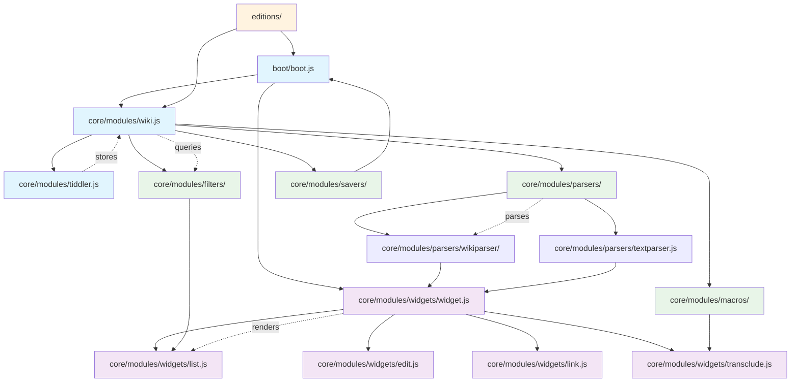

# TiddlyWiki Architecture - Minimal Spanning Graph

## Graph Explanation

### Core Dependencies (Solid Lines)
- **Boot System** → **Wiki Engine**: Boot initializes the wiki
- **Wiki Engine** → **All Systems**: Wiki coordinates all functionality
- **Widget System** → **UI Components**: Widgets render interface elements
- **Parser System** → **Widget System**: Parsed content feeds into widgets

### Data Relationships (Dotted Lines)
- **Tiddler** → **Wiki**: Tiddlers are stored in the wiki
- **Wiki** → **Filters**: Wiki provides data for filtering
- **Widgets** → **List**: Widgets render list components
- **Parser** → **WikiParser**: Parsers process content

### Key Architectural Principles

1. **Centralized Wiki Engine**: All data flows through the wiki
2. **Widget Hierarchy**: UI components are organized in a tree structure
3. **Parser Pipeline**: Content is parsed before rendering
4. **Module System**: Functionality is organized by type
5. **Edition Configuration**: Different deployments use different module sets

### Minimal Spanning Tree Properties

- **Connected**: All components are reachable from the boot system
- **Acyclic**: No circular dependencies in the core architecture
- **Minimal**: Only essential relationships shown
- **Hierarchical**: Clear parent-child relationships

This graph shows the minimal set of connections needed to understand how TiddlyWiki's components interact, focusing on the most critical dependencies that define the system's architecture. 