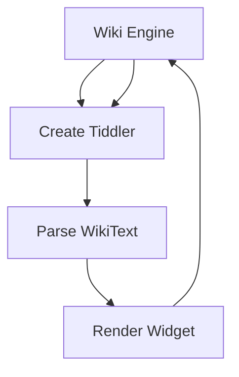
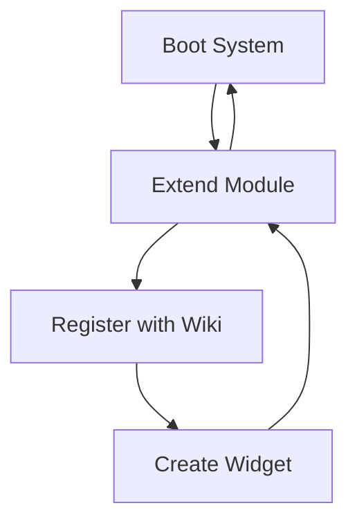
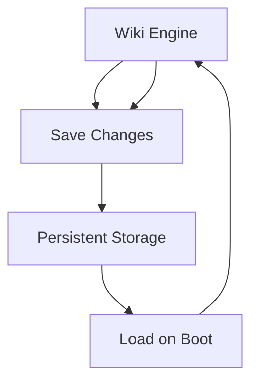
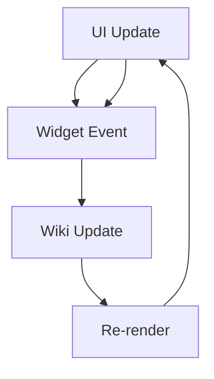
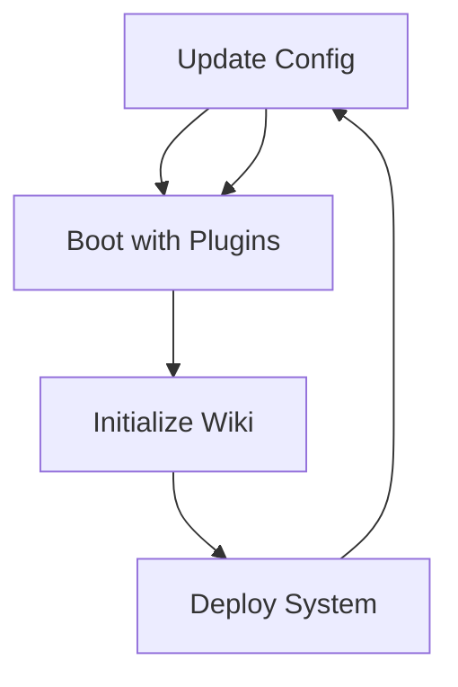

# TiddlyWiki Evolutionary Cycles

## Cycle 1: Content Creation Evolution (Cost: Low)

**Evolution**: Content → Parse → Render → Store → New Content
- **Cost**: Minimal (in-memory operations)
- **Benefit**: Immediate feedback loop for content creation
- **Stopping Point**: When tiddler is saved to persistent storage

## Cycle 2: Plugin Development Evolution (Cost: Medium)

**Evolution**: Plugin → Registration → Widget Creation → Module Extension → Plugin Enhancement
- **Cost**: Development time + testing
- **Benefit**: Extends system functionality
- **Stopping Point**: When plugin is stable and documented

## Cycle 3: Data Persistence Evolution (Cost: High)

**Evolution**: Changes → Save → Persist → Load → Restore → New Changes
- **Cost**: I/O operations + data integrity
- **Benefit**: Data persistence across sessions
- **Stopping Point**: When all changes are committed and verified

## Cycle 4: User Interface Evolution (Cost: Variable)

**Evolution**: User Input → Event Handling → Data Update → UI Refresh → User Feedback
- **Cost**: Performance (render cycles)
- **Benefit**: Responsive user experience
- **Stopping Point**: When UI is stable and responsive

## Cycle 5: Edition Configuration Evolution (Cost: Very High)

**Evolution**: Configuration → Boot → Deploy → Evaluate → Reconfigure
- **Cost**: Full system rebuild + testing
- **Benefit**: Optimized deployment for specific use cases
- **Stopping Point**: When edition meets requirements

## Evolutionary Stopping Criteria

### Content Creation Cycle
- **Stop when**: Tiddler is saved and validated
- **Cost threshold**: < 100ms
- **Quality gate**: Content is parseable and renderable

### Plugin Development Cycle
- **Stop when**: Plugin passes all tests
- **Cost threshold**: < 1 day development
- **Quality gate**: Plugin integrates seamlessly

### Data Persistence Cycle
- **Stop when**: All changes are committed
- **Cost threshold**: < 5 seconds
- **Quality gate**: Data integrity verified

### UI Evolution Cycle
- **Stop when**: UI is responsive (< 16ms frame time)
- **Cost threshold**: < 100ms per interaction
- **Quality gate**: User experience is smooth

### Edition Configuration Cycle
- **Stop when**: Edition meets all requirements
- **Cost threshold**: < 1 week configuration
- **Quality gate**: System is stable and performant

## Cost-Benefit Analysis

| Cycle Type | Cost | Benefit | Optimal Stopping Point |
|------------|------|---------|----------------------|
| Content Creation | Low | Immediate feedback | Save completion |
| Plugin Development | Medium | Extended functionality | Stable plugin |
| Data Persistence | High | Data safety | Commit verification |
| UI Evolution | Variable | User experience | Responsive UI |
| Edition Configuration | Very High | Optimized deployment | Requirements met |

## Evolutionary Principles

1. **Cycles represent learning**: Each iteration improves the system
2. **Costs are investments**: Higher costs often yield greater benefits
3. **Stopping points are quality gates**: Don't stop until quality criteria are met
4. **Evolution is incremental**: Small cycles build toward larger improvements
5. **Feedback drives evolution**: User/system feedback guides next iteration 